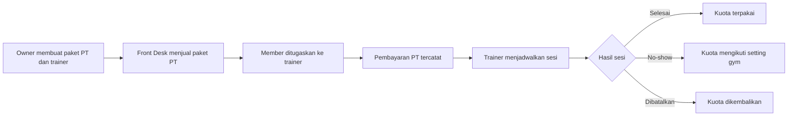
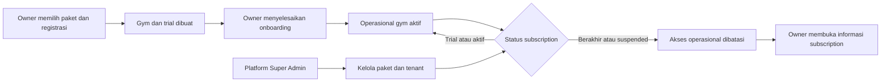
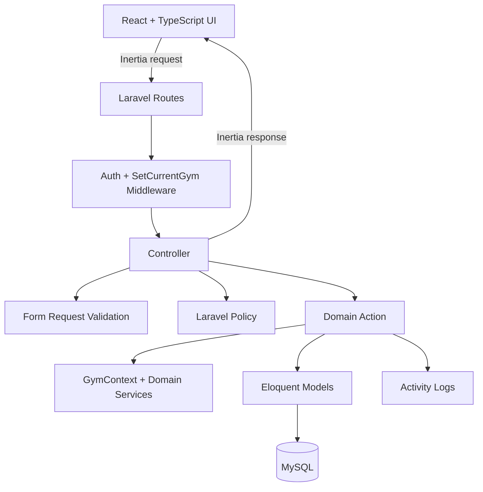
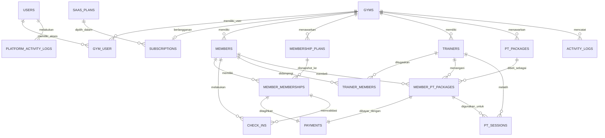

# Gymlo

> Platform SaaS manajemen gym multi-tenant untuk mengelola tenant, paket berlangganan, member, membership, pembayaran, check-in, trainer, dan Personal Training dalam satu aplikasi.

Gymlo dibangun sebagai studi kasus aplikasi bisnis berbasis web yang tidak berhenti pada CRUD. Setiap modul mengikuti proses operasional nyata, menerapkan pembatasan akses berbasis peran, menjaga konsistensi transaksi, dan mengisolasi data setiap gym di sisi backend.

## Ringkasan Project

| Informasi         | Detail                                                        |
| ----------------- | ------------------------------------------------------------- |
| Kategori          | SaaS / Gym Management System                                  |
| Arsitektur tenant | Shared database, shared schema, isolasi melalui `gym_id`      |
| Peran pengguna    | Platform Super Admin, Owner, Front Desk, Trainer              |
| Backend           | PHP 8.4, Laravel 13, MySQL                                    |
| Frontend          | Inertia.js 3, React 19, TypeScript, Tailwind CSS 4            |
| Quality tools     | Pest, PHPStan, Laravel Pint, ESLint, Prettier, GitHub Actions |
| Status            | Core operasional dan SaaS foundation telah diterapkan         |

## Masalah yang Diselesaikan

Operasional gym sering tersebar di spreadsheet, chat, dan pencatatan manual. Kondisi tersebut menyulitkan staf untuk mengetahui member yang masih aktif, pembayaran yang belum selesai, validitas kunjungan, sisa sesi Personal Training, dan jadwal trainer.

Gymlo menyatukan proses tersebut sehingga:

- Front Desk dapat melayani pendaftaran, pembayaran, dan check-in dari data yang sama.
- Owner memperoleh ringkasan bisnis dan laporan berbasis transaksi yang benar-benar sudah dibayar.
- Trainer hanya melihat client dan jadwal yang menjadi tanggung jawabnya.
- Setiap gym tetap terisolasi walaupun menggunakan database dan aplikasi yang sama.
- Perubahan penting dapat ditelusuri melalui activity log.

## Fitur Utama

### 1. Autentikasi dan tenant foundation

- Registrasi membuat akun Owner, gym, relasi role, dan audit log dalam satu database transaction.
- Login, logout, lupa password, reset password, pembaruan profil, dan perubahan password.
- Rate limiting pada login dan perubahan password.
- Middleware `SetCurrentGym` memvalidasi gym aktif dari relasi user, bukan dari input frontend.
- Pengaturan profil gym meliputi nama, kontak, alamat, logo privat, dan batas peringatan membership.

### 2. Manajemen member

- Nomor member otomatis berurutan per gym dengan format `MBR-000001`.
- Pencarian berdasarkan nomor, nama, dan telepon serta filter status dan pagination server-side.
- Profil member, foto privat, kontak darurat, catatan, serta status aktif/nonaktif.
- Riwayat membership, pembayaran, check-in, paket PT, dan sesi PT tersedia dari detail member.
- Data historis tidak dihapus saat member dinonaktifkan.

### 3. Paket dan periode membership

- CRUD paket membership dengan durasi hari, minggu, bulan, atau tahun.
- Harga disimpan sebagai `decimal(14,2)` dan diformat berdasarkan mata uang gym.
- Assignment dan renewal membuat snapshot nama paket, durasi, dan harga.
- Periode membership bersifat immutable dan tidak boleh saling tumpang tindih.
- Status upcoming, aktif, segera berakhir, atau kedaluwarsa dihitung dari tanggal lokal gym.

### 4. Invoice dan pembayaran

- Assignment atau renewal membership otomatis menghasilkan satu invoice.
- Nomor invoice berurutan per gym dengan format `INV-YYYYMM-######`.
- Pembayaran mendukung cash, transfer bank, kartu debit, kartu kredit, dan e-wallet.
- Invoice hanya dapat berubah dari `pending` menjadi `paid`; nominal berasal dari snapshot backend.
- Workspace pembayaran memisahkan transaksi Membership dan Personal Trainer.
- Revenue hanya menghitung transaksi `paid` berdasarkan `paid_at`, bukan tanggal invoice dibuat.

### 5. Check-in member

- Pencarian cepat member dan pemeriksaan kelayakan membership secara real time.
- Check-in hanya diizinkan untuk member aktif dengan membership aktif.
- Proteksi duplikasi selama lima menit tanpa membatasi kunjungan lain pada hari yang sama.
- Riwayat kunjungan dapat dicari dan difilter berdasarkan rentang tanggal.
- Recent check-ins diperbarui secara berkala untuk kebutuhan meja resepsionis.

### 6. Trainer dan assignment client

- Owner mengelola profil trainer dan setiap trainer dibuat bersama akun login individual.
- Kode trainer otomatis berurutan per gym.
- Owner dan Front Desk dapat menugaskan atau mengakhiri assignment member ke trainer.
- Riwayat assignment dipertahankan melalui periode aktif dan berakhir.
- Trainer hanya dapat membuka profil sendiri dan member yang sedang ditugaskan kepadanya.

### 7. Personal Training

- Owner mengelola katalog paket PT; Front Desk dapat melihat dan menjual paket aktif.
- Pembelian paket PT sekaligus memilih trainer, membuat assignment bila diperlukan, mengaktifkan kuota, mencatat pembayaran, dan menulis audit trail secara atomik.
- Sisa kuota memperhitungkan sesi selesai serta sesi terjadwal yang masih memesan slot.
- Penjadwalan menolak waktu lampau, paket kedaluwarsa, kuota habis, dan jadwal trainer yang bertabrakan.
- Sesi dapat dijadwalkan ulang, dibatalkan, diselesaikan, atau ditandai no-show.
- Pembatalan tidak memakai kuota; konsumsi kuota no-show mengikuti konfigurasi gym.
- Trainer mengelola jadwal dan hasil sesi hanya untuk client miliknya.

### 8. Dashboard dan laporan

- Dashboard berbeda untuk Owner, Front Desk, dan Trainer.
- Owner melihat revenue, membership, check-in, pembayaran tertunda, dan aktivitas terkini.
- Front Desk melihat metrik operasional tanpa data revenue khusus Owner.
- Trainer melihat jadwal hari ini, sesi berikutnya, client aktif, dan sisa kuota PT tanpa data finansial.
- Laporan Owner mencakup revenue, status member, status membership, volume check-in, dan member teratas.
- Filter laporan: hari ini, kemarin, minggu ini, bulan ini, bulan lalu, atau rentang kustom maksimal 366 hari.
- Snapshot dashboard dan laporan dimuat secara deferred dengan state loading, empty, error, dan retry.

### 9. SaaS foundation

- Satu codebase dan satu deployment melayani banyak gym dengan shared database serta isolasi data menggunakan `gym_id`.
- Platform Super Admin berada di luar role operasional gym dan memiliki workspace khusus untuk memantau tenant.
- Super Admin dapat membuat, mengubah, mengaktifkan, dan menonaktifkan paket SaaS.
- Registrasi Owner memilih paket lalu membuat akun, gym, trial/subscription, dan audit platform secara atomik.
- Onboarding memandu Owner melengkapi profil gym sebelum masuk ke fitur operasional.
- Status trial dan subscription mengendalikan akses tenant; Owner tetap dapat membuka halaman subscription ketika akses operasional berakhir.
- Super Admin dapat memperbarui status subscription serta mengaktifkan atau menangguhkan gym.
- Perubahan penting platform disimpan pada activity log terpisah dari activity log operasional tenant.

## Matriks Hak Akses

Platform Super Admin merupakan identitas platform pada tabel `users`, bukan role pada relasi `gym_user`. Karena itu akses platform tidak mewarisi data operasional tenant.

| Kapabilitas platform                      | Super Admin |
| ----------------------------------------- | :---------: |
| Melihat ringkasan seluruh tenant          |      ✓      |
| Mengelola paket SaaS                      |      ✓      |
| Mengubah status subscription tenant       |      ✓      |
| Mengaktifkan atau menangguhkan gym        |      ✓      |
| Mengakses operasional gym secara otomatis |      —      |

| Kapabilitas                    | Owner | Front Desk |    Trainer     |
| ------------------------------ | :---: | :--------: | :------------: |
| Melihat dashboard sesuai peran |   ✓   |     ✓      |       ✓        |
| Mengubah profil dan logo gym   |   ✓   |     —      |       —        |
| Mengelola member               |   ✓   |     ✓      |       —        |
| Mengelola paket membership     |   ✓   |     ✓      |       —        |
| Assign dan renewal membership  |   ✓   |     ✓      |       —        |
| Memproses pembayaran           |   ✓   |     ✓      |       —        |
| Melakukan check-in             |   ✓   |     ✓      |       —        |
| Mengelola profil trainer       |   ✓   |     —      |       —        |
| Mengelola assignment trainer   |   ✓   |     ✓      |       —        |
| Mengelola katalog paket PT     |   ✓   |   Lihat    |       —        |
| Menjual paket PT               |   ✓   |     ✓      |       —        |
| Menjadwalkan sesi PT           |   ✓   |     ✓      | Client sendiri |
| Menyelesaikan/no-show sesi PT  |   —   |     —      | Client sendiri |
| Melihat laporan dan revenue    |   ✓   |     —      |       —        |

Semua izin pada tabel di atas ditegakkan kembali oleh Laravel Policy di backend. Permission yang dikirim ke React hanya digunakan untuk mengatur tampilan antarmuka.

## Workflow Operasional

### Workflow membership

```mermaid
flowchart LR
    A[Front Desk membuat atau memilih member] --> B[Memilih paket membership]
    B --> C[Backend memvalidasi tenant dan periode]
    C --> D[Menyimpan snapshot periode membership]
    D --> E[Membuat invoice pending]
    E --> F[Front Desk mengonfirmasi pembayaran]
    F --> G[Invoice paid dan revenue tercatat]
    G --> H[Member dapat check-in selama periode aktif]
```



### Workflow Personal Training



### Workflow Owner

1. Memilih paket SaaS, mendaftarkan gym, dan menyelesaikan onboarding profil operasional.
2. Menyiapkan paket membership, trainer, dan paket Personal Training.
3. Memantau member aktif, membership segera berakhir, pembayaran tertunda, check-in, dan revenue.
4. Membuka laporan berdasarkan periode untuk evaluasi operasional dan bisnis.

### Workflow SaaS



## Arsitektur Aplikasi

Gymlo menggunakan satu project monolith modern untuk seluruh tenant dan workspace platform. Laravel menangani routing, autentikasi, otorisasi, validasi, dan domain logic; React menangani pengalaman SPA; Inertia menjadi penghubung tanpa REST API terpisah. Domain atau subdomain per gym dapat ditambahkan pada deployment tanpa menggandakan source code.



### Pembagian tanggung jawab

| Layer           | Tanggung jawab                                                      |
| --------------- | ------------------------------------------------------------------- |
| Middleware      | Menentukan tenant aktif dan menolak akun/gym nonaktif               |
| Form Request    | Validasi dan normalisasi input                                      |
| Policy          | Otorisasi role serta kepemilikan resource tenant                    |
| Controller      | Orkestrasi request dan Inertia response                             |
| Action          | Aturan bisnis dan transaction boundary                              |
| Support service | Kalkulasi dashboard, laporan, eligibility, dan penjadwalan          |
| Model           | Relasi Eloquent, casts, dan query domain                            |
| React page      | Interaksi pengguna, feedback validasi, filter, dan responsive state |

### Isolasi multi-tenant

```text
Authenticated User
       |
       v
active gym_user relation + active gym
       |
       v
SetCurrentGym middleware
       |
       v
request-scoped GymContext
       |
       v
gym relation / gym_id-scoped operational queries
```

`current_gym_id` dapat disimpan di session, tetapi nilainya selalu diverifikasi terhadap relasi gym aktif milik user. Resource dari gym lain menghasilkan respons tidak ditemukan atau tidak diizinkan. Backend tidak menerima `gym_id`, nomor member, nomor trainer, nomor invoice, maupun nominal pembayaran dari frontend sebagai sumber kebenaran.

## Model Data Inti



## Business Rules dan Integritas Data

- Setiap query operasional wajib melalui gym aktif dari `GymContext`.
- Sequence member, trainer, dan invoice dialokasikan saat row gym dikunci dengan `lockForUpdate()`.
- Proses yang mengubah beberapa tabel menggunakan database transaction.
- Membership menyimpan snapshot paket agar histori tidak berubah ketika master paket diedit.
- Periode membership tidak overlap dan renewal membuat record historis baru.
- Invoice membership immutable, unik per periode, dan nominalnya tidak dapat dikirim ulang dari frontend.
- Revenue hanya berasal dari pembayaran berstatus `paid` dan waktu `paid_at`.
- Check-in menyimpan membership yang dipakai untuk validasi serta user yang melayani.
- Kuota PT aman terhadap sesi paralel melalui penguncian paket member dan validasi jadwal.
- Foto member dan logo gym disimpan pada private storage serta dilayani melalui endpoint terotorisasi.
- Aktivitas penting seperti pembuatan, perubahan status, pembayaran, assignment, dan sesi PT dicatat pada audit log.
- Identitas Super Admin platform tidak disimpan sebagai role tenant dan tidak otomatis memperoleh akses operasional gym.
- Perubahan status paket, subscription, serta gym dikunci dan dijalankan dalam transaction sebelum dicatat pada audit platform.

## UI/UX

- Antarmuka berbahasa Indonesia untuk kebutuhan operator gym.
- Layout responsif dengan sidebar desktop dan navigasi mobile.
- Tabel pada layar lebar dan tampilan card pada layar kecil untuk workspace operasional.
- Pencarian, filter, pagination, empty state, konfirmasi, dan feedback validasi tersedia pada modul utama.
- Dashboard disesuaikan dengan prioritas tiap peran: bisnis untuk Owner, operasional harian untuk Front Desk, dan agenda client untuk Trainer.
- Navigasi frontend menggunakan helper route bertipe dari Laravel Wayfinder.

## Tech Stack

| Area            | Teknologi                               |
| --------------- | --------------------------------------- |
| Language        | PHP 8.4, TypeScript                     |
| Framework       | Laravel 13, React 19                    |
| SPA bridge      | Inertia.js 3                            |
| Styling         | Tailwind CSS 4, Radix UI primitives     |
| Database        | MySQL; SQLite in-memory pada CI         |
| Authentication  | Laravel Fortify                         |
| Typed routes    | Laravel Wayfinder                       |
| Testing         | Pest 5, PHPUnit 13                      |
| Static analysis | PHPStan / Larastan, TypeScript compiler |
| Code quality    | Laravel Pint, ESLint, Prettier          |
| Build           | Vite 8                                  |
| CI              | GitHub Actions                          |

## Struktur Project

```text
app/
├── Actions/             # Use case dan transaction boundary
├── Enums/               # Status dan role domain
├── Http/
│   ├── Controllers/     # Orkestrasi HTTP dan Inertia
│   ├── Middleware/      # Resolusi tenant aktif
│   └── Requests/        # Validasi input
├── Models/              # Model dan relasi Eloquent
├── Policies/            # Otorisasi backend
└── Support/             # GymContext, snapshot, eligibility, scheduler
database/
├── factories/           # Data builder untuk testing
├── migrations/          # Skema dan index database
└── seeders/             # Data demo lokal/testing
resources/js/
├── actions/             # Generated Wayfinder controller actions
├── components/          # Komponen UI reusable
├── pages/               # Halaman Inertia React per modul
├── routes/              # Generated named-route helpers
└── types/               # Kontrak TypeScript
tests/
├── Feature/             # Pengujian workflow dan integrasi
└── Unit/                # Pengujian unit
```

## Pengujian dan CI

Test suite memverifikasi workflow bisnis, bukan hanya respons halaman. Cakupannya meliputi:

- autentikasi, registration transaction, dan rate limiting;
- akses Super Admin, lifecycle paket SaaS, onboarding, trial/subscription, dan suspension;
- isolasi cross-tenant serta pembatasan Owner/Front Desk/Trainer;
- sequence nomor pada request bersamaan dan audit trail;
- lifecycle membership, invoice, pembayaran, dan check-in;
- laporan berbasis timezone dan transaksi paid;
- trainer assignment, penjadwalan bentrok, kuota PT, cancellation, completion, dan no-show;
- validasi upload privat dan pengaturan profil gym.

Pipeline GitHub Actions menyiapkan aplikasi dari checkout bersih, menjalankan migration dan Wayfinder generation, kemudian memeriksa:

```bash
composer ci:check
npm run build
```

`composer ci:check` mencakup Pint, Prettier, TypeScript, ESLint, PHPStan/Larastan, dan seluruh Pest test suite.

Snapshot verifikasi lokal saat dokumentasi diperbarui:

- 102 test passed, 3 skipped, dan 1.160 assertions;
- Pint, Prettier, ESLint, TypeScript, dan PHPStan passed;
- production frontend build passed;
- seluruh migration aktif berstatus `Ran` pada MySQL.

## Menjalankan Project Secara Lokal

### Prasyarat

- PHP 8.4 dan Composer 2
- Node.js 22 dan npm
- MySQL 8 atau MariaDB yang kompatibel

### Instalasi

```bash
composer install
npm install
copy .env.example .env
php artisan key:generate --no-interaction
php artisan migrate --seed --no-interaction
php artisan wayfinder:generate --with-form --no-interaction
npm run build
composer run dev
```

Pada Linux/macOS, gunakan `cp .env.example .env` sebagai pengganti `copy`. Sesuaikan koneksi database pada `.env` sebelum menjalankan migration.

### Akun demo

Seeder demo hanya dapat berjalan pada environment `local` atau `testing`. Password seluruh akun demo adalah `password`.

| Peran       | Email                |
| ----------- | -------------------- |
| Super Admin | `platform@gym.test`  |
| Owner       | `owner@gym.test`     |
| Front Desk  | `frontdesk@gym.test` |
| Trainer     | `trainer@gym.test`   |

Jangan menjalankan demo seeder atau menggunakan credential tersebut di production.

## Nilai Teknis

Project ini mendemonstrasikan kemampuan membangun aplikasi bisnis end-to-end, khususnya:

- merancang arsitektur multi-tenant dengan shared schema yang aman;
- memisahkan control plane SaaS dari role dan data operasional setiap tenant;
- menerjemahkan proses bisnis menjadi transaction-safe domain actions;
- memisahkan otorisasi backend dari visibilitas UI;
- menangani uang, timezone, periode membership, sequence, dan kuota tanpa bergantung pada perhitungan frontend;
- membangun SPA responsif tanpa menduplikasi backend menjadi REST API terpisah;
- menulis pengujian integrasi untuk positive path, denial path, cross-tenant access, dan edge cases;
- menyiapkan static analysis, formatting, build, serta continuous integration.

## Batasan dan Pengembangan Berikutnya

- UI pemilih gym untuk user yang memiliki akses ke beberapa tenant belum tersedia; middleware memakai gym session yang valid atau gym aktif pertama.
- Belum ada partial payment, refund, pembatalan invoice, atau rekonsiliasi payment gateway.
- Belum ada modul workout plan, inventory, payroll/komisi trainer, dan booking kelas grup.
- Subscription masih dikelola manual oleh Super Admin; belum ada payment gateway SaaS, webhook, invoice langganan, proration, atau renewal otomatis.
- Dokumentasi visual dapat dilengkapi dengan screenshot dashboard setiap role, alur pembayaran, check-in, dan jadwal PT saat project dipublikasikan.
